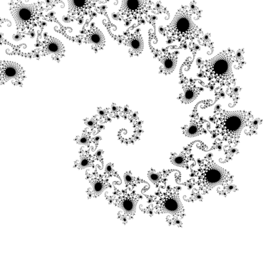

## Programmation Avancée en Python - TP Final

### Informations Générales

- ssurez vous que vous vous places dans le dossier racine du projet avant d'effectuer ces commandes.

- Le code source se trouve sous le dossier `tpf`

- Le coeur du code source se trouve sous le fichier `mandelbrot.py`

### 1. Installation

```bash
pip install .
```

### 2. Documentation

Documentation HTML (En anglais) disponible sous le format HTML dans le fichier (**ouvrez sur un navigateur**):
```c
./tpf/doc/build/html/index.html
```

[Doc HTML](tpf/doc/build/html/index.html)

### 3. Exemples de plots genérés

#### Exemple 1
```python
plot_mandelbrot()
```
```bash
MandelbrotPlot -o "mandelbrot.png"
```


#### Exemple 2

```python
     plot_mandelbrot(
         zmin=-0.7440+0.1305j,
         zmax=-0.7425+0.1320j,
         pixel_size=5e-7,
         max_iter=200,
         figname="Mandelbrot_tentacle.png"
     )
```


#### Exemple 3
Prend quelques minutes
```python
plot_julia(
    c=-0.8 + 0.156j,
    zmin=-2-1j,
    zmax=2+1j,
    pixel_size=5e-4,
    max_iter=100,
    figname="Julia_-0.8+0.156j.png"
)
```
```bash
JuliaPlot -o "julia.png"
```


#### Exemple 4
```bash
JuliaPlot -c="-0.8j" --pixel_size=5e-2 --max-iter=50 -o "thunder-julia.png"
```


### 4. Generation de la documentation

```bash
conda activate ENV_NAME
conda install sphinx sphinxcontrib-napoleon
```

```bash
cd tpf
cd doc
make html
```

- Versions:
    - python >= 3.6
    - numpy >= 1.17.*
    - matplotlib >= 3.*